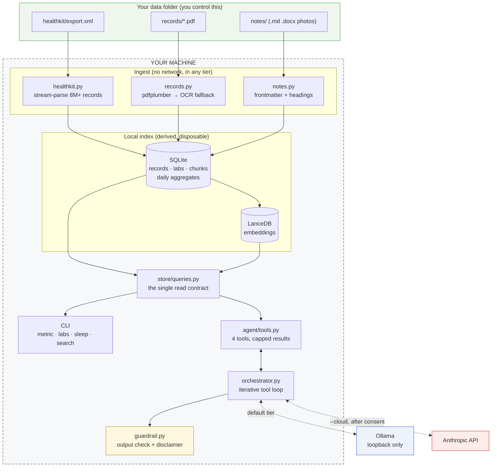

# health-agent

Ask questions about your own health data (Apple Health exports, bloodwork PDFs,
medical records, personal notes) with **the data and the model both staying on
your machine**.

```bash
health-agent ask "How has my LDL changed since last year?"
```

```
Your LDL cholesterol has come down across your two most recent panels:

| Date       | LDL (mg/dL) | Reference | Flag | Source                    |
|------------|-------------|-----------|------|---------------------------|
| 2025-09-12 | 128         | 0–99      | H    | labs_2025-09-12.pdf, p.1  |
| 2026-03-10 | 112         | 0–99      | H    | labs_2026-03-10.pdf, p.1  |

Both are flagged high by the lab. The most recent is 16 mg/dL lower than the
previous one but still outside the printed range.

These are the values recorded in your own files, not medical advice.
```

No account, no upload, no server. A local model reads a local index and cites the
file and page behind every number.


*Recorded from `demo/demo.sh` against the synthetic fixtures. You can run the
same thing, and regenerate it with `vhs demo/demo.tape`.*

**Why this exists.** Health assistants generally ask you to send your medical
records somewhere. This one is an argument that you don't have to. It is also an
argument that the claim should be *checkable* rather than asserted. `health-agent offline-check`
runs the entire pipeline inside a kernel-level sandbox with networking denied and
shows you the result. [`THREAT_MODEL.md`](THREAT_MODEL.md) states every claim,
how to verify it, and what this tool does **not** protect you from.

> **Status: v0.1, feature-complete for its scope.** All three source types
> ingest, natural-language questions work end to end, accuracy is measured
> against a 20-question eval set, and the privacy claims are falsifiable.
> Post-release directions are in [`ROADMAP.md`](ROADMAP.md). The largest is
> literature grounding with evidence-graded citations.
>
> Not a medical device, and not a substitute for your clinician. See
> [Not a medical device](#not-a-medical-device).

## What works today

Ask in plain language, or query directly. The structured commands are instant
where `ask` takes 25 to 60 seconds. Both read through the same code path, so
they cannot disagree.

```bash
health-agent ask "My notes mention a vitamin D result. What did the lab say?"
health-agent ask "Anything in my recent labs I should ask my doctor about?" --show-tools
```

Setup and inspection:

```bash
health-agent ingest ~/Downloads/export.zip     # export.xml, export.zip, PDFs, notes, photos, .docx, or a folder
health-agent literature install sample         # optional: ~2,000 PubMed abstracts, one download, asks first
health-agent check                             # what's installed, what's missing
health-agent visit-prep                        # questions worth asking at your next appointment
health-agent stats
```

Photos, screenshots, and Word documents dropped into `notes/` are read too:
`.png`, `.jpg`, `.jpeg`, and `.heic` go through Tesseract, and `.heic` also
needs the `[ocr]` extra (`pip install -e '.[ocr]'`); all are cited as
read by OCR. `.docx` is ingested exactly as a markdown note, headings and
tables included. Since there is no intake step, this is how a medication
list, a conditions list, or a clinic letter gets in, as a file. A
photographed lab report becomes searchable text, never a trend line. OCR on
a phone photo is the least reliable extraction the tool has, and a wrong lab
value poisons a trend where a missing one is a visible gap, so a report you
want in a trend has to arrive as a PDF.

HealthKit metrics:

```bash
health-agent metric resting-hr --by week
health-agent metric steps --from 2026-03-01 --to 2026-03-31
health-agent metric sleep --by day
health-agent workouts
```

Bloodwork and records:

```bash
health-agent documents
health-agent labs                     # every analyte found across your reports
health-agent labs ldl                 # one analyte over time, with citations
```

Notes, and search across everything:

```bash
health-agent notes                    # what's ingested, with dates and tags
health-agent notes --tags             # every tag
health-agent notes --tag followup
health-agent search "vitamin d"       # notes and records in one ranked list
health-agent search "coffee" --kind note
health-agent search "metformin" --kind image   # photos and screenshots only
```

Everything above is local computation over a SQLite index and a file-based
vector store. The only process that ever opens a socket is embedding, and only
to Ollama on localhost (see [Privacy](#privacy)). The two exceptions are
`literature install`, which downloads a public file once, after a notice, and
sends nothing of yours, and `literature build-pack`, a maintainer command that
queries NCBI (see [Medical literature corpus](#medical-literature-corpus)).

## Try it without your own data

The repo ships synthetic fixtures, invented values in the real formats, so you
can exercise the whole pipeline before pointing it at anything personal. The
demo runs entirely against those:

```bash
./demo/demo.sh          # add --fast to skip the steps that need a local model
```

It ingests an export, lab PDFs and notes, then walks through the queries below
and finishes by proving nothing touched the network. Real output from it:

```text
$ health-agent labs ldl
LDL cholesterol (ldl)

collected   value  unit   reference  flag  source
----------  -----  -----  ---------  ----  ------------------------------------
2025-09-12  128 *  mg/dL  0-99       H     labs_2025-09-12.pdf, p.1, 2025-09-12
2026-03-10  112 *  mg/dL  0-99       H     labs_2026-03-10.pdf, p.1, 2026-03-10

* outside the reference range printed on that report

first 128 -> latest 112 (down 16, 12.5%)

These are the numbers as printed on your reports. Interpretation is for you
and your clinician.
```

```text
$ health-agent labs hba1c
collected   value  unit  reference  flag  source
----------  -----  ----  ---------  ----  ------------------------------------------
2025-03-04  5.9 *  %     4.8-5.6    H     scan_2025-03-04.pdf, p.1, 2025-03-04 [OCR]
2025-09-12  5.7 *  %     4.8-5.6    H     labs_2025-09-12.pdf, p.1, 2025-09-12
2026-03-10    5.4  %     4.8-5.6    -     labs_2026-03-10.pdf, p.1, 2026-03-10

[OCR] read from a scanned page with no text layer. OCR misreads digits — a
reference range of 100-199 can arrive as 100-139 — so check these against
the original before relying on them.
```

Three reports from three different labs, naming the analyte three different
ways, merged into one trend. The scanned one is marked as less trustworthy
rather than silently mixed in.

To regenerate the demo GIF (`demo/demo.tape` is checked in, so the recording
is reproducible):

```bash
brew install vhs && vhs demo/demo.tape
```

## Install

Requires Python 3.11+.

```bash
pip install -e ".[dev]"
```

Two optional pieces, both of which the tool works without and tells you about:

- **Tesseract**, needed for scanned records with no text layer and for
  photos or screenshots in `notes/`.
  `brew install tesseract` (macOS) or `apt install tesseract-ocr` (Debian).
- **Ollama**, needed for `ask` and for semantic search. Without it, `search`
  falls back to keyword matching and says so, and everything else still works.
  ```bash
  ollama pull qwen3.6:27b && ollama pull nomic-embed-text
  ```
  The 27B model needs roughly 18 GB of memory. Override with `--model` or
  `$HEALTH_AGENT_MODEL`.

  On a machine that cannot hold that, `qwen3.5:9b` (6.6 GB) works, and is
  the only smaller model with an eval row behind it
  ([run 6](tests/eval_results.md)): 24/27 numbers right against 25/27 for
  the default, no diagnosis on 27/27, four times faster. What it loses is
  judgment about which tool to call. It skipped the literature search on
  the A1c-cutoff question every time it was asked, and the citation guard
  had to catch what it wrote from memory; it also drops the source
  filename more often. The qwen3.6 family has no tag smaller than 27b.
  ```bash
  ollama pull qwen3.5:9b
  health-agent ask --model qwen3.5:9b "What was my average resting heart rate in March?"
  ```

Run `health-agent check` to see what's present. Packaging is pip-from-source
only for now; PyPI and Homebrew are deferred.

## Where your data lives

```
~/HealthData/                 <- you control this; nothing is written outside it
├── healthkit/export.xml
├── records/*.pdf             <- bloodwork, medical records
├── notes/                    <- .md .txt .docx, and photos or screenshots
└── .index/
    ├── health.db             <- SQLite: records, labs, aggregates, chunk text
    └── vectors/              <- LanceDB: embeddings
```

Both halves of the index are generated and disposable. `health-agent reset`
deletes them and `ingest` rebuilds from your source files. Override locations
with `--data-dir`, `--index`, or `$HEALTH_AGENT_DATA_DIR`.

## Measured performance

Numbers from an actual Apple Health export. Query latency for
natural-language questions will be added once the model is in the loop.

| | |
| --- | --- |
| Export size | 3.7 GB, 8.3M records, 75 HealthKit types, 41 recording sources |
| Ingest | 6.5 min to parse, 6.8 min wall including hashing and rollup |
| Peak memory | ~1.4 GB, almost all of it SQLite's page cache. The XML parse itself holds flat at ~13 MB regardless of file size |
| Index size | 4.5 GB |
| `stats` | 0.13 s |
| `metric steps --by month` | 0.07 s |

Aggregate queries stay in the tens of milliseconds because they read a
materialized daily rollup (100k rows) rather than the raw record table.

## Architecture, and where the data stops

Everything inside the dashed box happens on your machine. The only two arrows
that cross it are the local model (loopback, enforced) and the opt-in cloud tier
(consent-gated).



Three things the diagram is making explicit:

**Source files are read, never written.** The index is derived and disposable.
`reset` deletes it, `ingest` rebuilds it.

**`store/queries.py` is the only read path.** The CLI and the agent's tools call
the same functions, so `health-agent labs ldl` and asking the model about LDL
cannot disagree. There are not two implementations that happen to match; there
is one.

**Ingest never touches the network in either tier.** That is the claim
`offline-check` proves at the kernel level.

## How the agent works

There is no orchestration framework. The tool-calling loop is about sixty lines in
[`agent/orchestrator.py`](health_agent/agent/orchestrator.py), talking directly
to Ollama's chat API. Three tools (`query_healthkit`, `get_lab_trend`,
`search_records`) are thin adapters over the same `store/queries.py` functions
the CLI uses, so the model and `health-agent labs` cannot report different
numbers for the same question. A fourth, `search_medical_literature`, returns
dated, evidence-tiered findings from the optional literature corpus (below)
instead of letting the model answer clinical questions from its training data.

Three decisions in that loop came out of measuring the model:

**The loop is iterative, not single-shot.** Asked to compare two sources,
`qwen3.6:27b` requests one tool, and only asks for the second after seeing the
first result. A single-shot design would answer such questions with half the
data and no sign anything was missing.

**Thinking mode is off by default.** Enabling it tripled latency (17 s to 51 s on
a tool-call decision) and produced a byte-identical tool call. `--think` turns it
on when a question is worth the wait.

**The model never does arithmetic.** Every tool result includes a precomputed
`overall` figure for the requested range. Before that existed, asked for an
average resting heart rate, the model summed seven daily values by hand and
answered 59.6 where the answer is exactly 60.0. A wrong number delivered
fluently is this project's worst failure mode, so any figure the model might
otherwise compute is handed to it already computed.

**Tools batch, because the model won't.** Asked which results were abnormal, the
model looked up all 23 analytes one at a time. That was 23 tool calls and six minutes. The
lab tool now takes a list and precomputes the out-of-range set, which turned that
into a single call.

Tools also return *absence* as data, coverage ranges rather than an empty list.
A model told only "no results" will reach for the nearest numbers it can
see and present them as an answer.

Measured on an M5 with `qwen3.6:27b`: 25-60 s for a focused question, ~165 s for
one that sweeps every lab analyte. An answer that used no tool at all is flagged
as ungrounded rather than presented as though it came from your data.

## Medical literature corpus

`search_medical_literature` answers questions like "what does the research say
about X" from a **local, curated corpus of MEDLINE citations**, dated,
evidence-tiered, and cited by PMID, instead of the model's training data.

The corpus arrives as packs. Each is one download of abstracts on one broad
area, published on this project's GitHub releases:

```bash
health-agent literature packs             # the catalog, and what is installed
health-agent literature install sample    # a first try
health-agent literature status
```

There are five. `sample` is about 2,000 recent papers across all four areas
below, with no evidence filter, so the tiers show as they really are.
`cardiovascular` covers blood pressure, cholesterol, HDL, LDL, and
cardiovascular disease. `metabolic` covers blood glucose, HbA1c, type 2
diabetes, obesity, and thyroid. `sleep` covers sleep duration, quality, and
disorders. `exercise` covers physical activity, fitness, training, and
recovery. The four topical packs hold meta-analyses, systematic reviews,
guidelines, and randomized controlled trials from 2015 on. Each installs on
its own, with no dependency on another, and an article in two packs is stored
once. Pack sizes, as a download and as an article count, are listed in each
release's notes.

The first `install` prints a notice and asks before it connects. What the
download reveals is which pack you chose, your IP address, and the tool's
version, to GitHub. Nothing from your data folder is sent, and nothing about
your questions. The pack you pick is visible to the host, which is why packs
are broad areas and never a single condition. Running `install` again for a
version you already have makes no request at all, unless you pass `--force`
or `--from`. See [THREAT_MODEL.md](THREAT_MODEL.md) Claim 6.

If you have your own MEDLINE export, `build` still reads it directly:

```bash
health-agent literature build --from medline_export.xml --slug cardiometabolic
health-agent literature build --from medline_export.xml --slug cardiometabolic --rebuild
```

A few things worth stating plainly:

- **The corpus is optional.** Nothing else in this tool depends on it. Without
  one, `search_medical_literature` reports that no corpus is installed and
  tells the model not to answer from recalled medical knowledge instead of
  quietly falling back on it. That is the exact failure this tool exists to
  close (see [Not a medical device](#not-a-medical-device)).
- **`health-agent literature install`** is how most people get one, and
  **`health-agent literature build`** creates one from a MEDLINE XML export
  you supply. See [LICENSES.md](LICENSES.md) for what's retained and under
  what terms.
  A corpus built by an older release is refused on open, with a message
  naming `--rebuild`, which deletes the corpus (and only the corpus) before
  building.
- **Evidence tiers come from publication metadata, not judgement.** A tier is
  read off MEDLINE's own `PublicationType` field, or it is `unknown`. The
  ladder, strongest first: meta-analysis and systematic review; guideline;
  randomized controlled trial; other clinical trials (including phase trials
  and non-randomized controlled trials); narrative and scoping reviews;
  observational; case report. Nothing inspects a title, an abstract, or asks
  a model to guess; an inferred tier would be a fabricated credential, and
  the feature's whole value is that its citations can be trusted.
- **Most of a real corpus has no tier, and that is not a bug.** Measured
  against 2,000 real PubMed abstracts, 65.5% resolved to `unknown`, and five
  in six of those carried `Journal Article` and nothing else: PubMed simply
  does not record a study design for most primary research. A `min_tier`
  floor therefore excludes most of the corpus, not just weak studies. The
  tool says so in its payload whenever a floor is set, and a filtered miss
  is reported as a filter result rather than as "the corpus holds nothing".
  Trial protocols are kept, flagged, and unranked: a plan reports no results.
- **Nothing updates on its own.** There is no update check and no background
  fetch. A newer pack version reaches you when you run `install` again, and
  the tool never connects at any other time. `offline-check` still proves
  that the ask path cannot.

## Visit prep

`health-agent visit-prep` writes a short sheet of questions to bring to a
clinician. Each one ties to a value in your own files:

- a lab result outside the range printed on the report, with the previous
  result so the direction is visible
- one that was outside and has come back inside, with the question of
  whether to keep checking it
- one inside the range but within a tenth of its span of a limit, moving
  toward it since the previous result
- a watch metric (resting heart rate, weight, steps, HRV, sleep) whose
  average over the last 30 days moved past this tool's cutoff against the
  30 days before

Every question opens with "Ask". The sentence after it gives the value, the
printed range, the date, and the report it came from. When a literature
pack is installed, each lab question also names one finding by title, year,
tier, and PMID. It does not quote the finding.

There is no model in this command. The output is a list of your numbers
with a fixed sentence around each, and a template does that exactly, where
a model does it approximately, and on the evidence of
[eval run 6](tests/eval_results.md) sometimes with a recalled threshold
attached. The sheet also runs on a machine that cannot run the model. The
guardrail can be run over the finished sheet as a test. A template that
reads as interpretation fails the suite.

It does not read your notes. Medications and conditions you wrote down are
free text. A rule cannot tell "stopped metformin" from "started metformin".
`ask` handles those. The cutoffs for a watch metric are this tool's own,
chosen to sit clear of day-to-day noise. The sheet names them next to each
one.

```bash
health-agent visit-prep                # to the terminal
health-agent visit-prep --out prep.md  # to a file you can print
```

## Design notes worth knowing

**Aggregation follows HealthKit semantics.** Cumulative types (steps, energy) are
summed over a period; discrete types (heart rate, weight) are averaged; category
types (sleep) are totalled by duration. Getting this backwards produces
confident, wrong numbers. "Average steps per day: 41" is an averaged sample
count, not a daily total. Override with `--agg`.

**Multiple devices recording the same metric are not summed.** If an iPhone and
an Apple Watch both log step counts, adding their totals roughly doubles your
day. The default reports the largest single source's total and tells you when
more than one source contributed. Use `--source NAME` to pin one, or
`--combine sum` if you know the sources don't overlap.

**Re-ingesting is safe.** Every Apple export contains your full history, so
records carry a content hash and a second ingest inserts nothing new.

**Timestamps keep their own UTC offset.** A sample recorded at 22:30 on a
`-0500` evening belongs to that calendar date, not to the following UTC day, and
the offset changes across DST boundaries within a single export.

**Lab values are extracted twice and stored once.** Reports are laid out either
as ruled tables or as whitespace-aligned columns, and real reports mix both on
one page. Both extraction passes run; a content hash means a value found by both
is stored once. Every stored value keeps the source line it came from.

**Nothing is interpreted.** `labs` marks a value as outside the reference range
*the lab printed on that report*, and mixed units across labs are shown as
printed and never converted. Converting without knowing the assay is how you get
confidently wrong numbers.

**OCR-derived values are marked.** Scanned reports with no
text layer go through OCR, which reads result values and H/L flags reliably but
degrades on units and reference ranges. A range of `100-199` can arrive as
`100-139`. Those values are stored and shown with an `[OCR]` marker and a note
to check them against the original.

**Notes are never mined for lab values.** "My LDL was 112" in a journal entry is
recollection, not a lab result. Letting prose write into the lab table would put
uncited numbers into trends that are supposed to be traceable to a report. The
same rule covers photos: a photographed lab report is searchable text, never a
trend line.

**Notes cite headings; PDFs cite pages.** A note has no page numbers, so its
chunks carry the heading trail they came from and cite as
`sleep-log.md, Sleep log > Night by night, 2026-03-11`.

**Undated notes stay undated.** A note with no date in its frontmatter or
filename is reported as undated rather than dated from file mtime. Copying a
folder rewrites mtimes and would silently re-date years of notes.

## Two tiers, and the difference is not cosmetic

**Local (default).** The model runs on your machine through Ollama. Nothing
leaves the host. This is the product; it needs no flags.

**Cloud (`--cloud`, opt-in).** Answers come from Anthropic's API. Your question,
a description of what your index contains, and **the results of every tool call,
including verbatim excerpts from your records and notes**, are transmitted
per request. Your source files stay on disk.

That second tier is **hybrid, not local**, and this README will not call it
anything else. Before the first `--cloud` query the tool prints a full
disclosure and requires you to type `yes`. Not `y`, and never a silent flag.
Consent is recorded per data folder, and re-requested if what gets sent ever
changes.

```bash
health-agent cloud-consent              # what you agreed to, and when
health-agent cloud-consent --show-notice
health-agent cloud-consent --revoke
```

The cloud tier is an optional install (`pip install -e ".[cloud]"`). Someone who
never opts in has no vendor SDK and no HTTP client on their machine at all.

## Privacy

The design commitment (plan §5): the default path makes no outbound network
calls, and the cloud tier is an explicit, clearly flagged opt-in rather than a
silent fallback.

**Exactly three modules can reach the network**, and the split is the point:

| Module | Tier | Talks to |
| --- | --- | --- |
| `ollama_client.py` | local | Ollama on loopback, on-device inference |
| `agent/backends.py` | cloud | Anthropic, only after recorded consent |
| `literature/fetch/client.py` | packs | NCBI and GitHub, from two commands, after a separate notice |

The local one is enforced, not assumed: a non-loopback Ollama host is refused
unless you explicitly set `HEALTH_AGENT_ALLOW_REMOTE_OLLAMA=1`, because pointing
this at someone else's inference server would quietly turn the local tier into a
hybrid one.

A test (`test_the_network_surface_is_exactly_three_modules`) fails if that set
ever changes, **and it counts the vendor SDK**, because `import anthropic`
opens sockets just as surely as `import urllib`. A check that only looked for
stdlib transports would have passed while the cloud backend shipped data off the
machine. Ingestion, storage, aggregation, and search remain pure local
computation in both tiers.

### Prove it yourself

```bash
health-agent offline-check
```

This runs the real pipeline (ingest, OCR, aggregation, lab trends, vector
search, and every agent tool) inside a sandbox with network access denied, and
tells you **which enforcement actually applied**:

```
  enforced  OS sandbox — the kernel denies every socket syscall, including
            from native code

  [ok  ] ingest healthkit export   25 records
  [ok  ] ingest record PDFs (incl. OCR path)   3 documents
  [ok  ] vector search (LanceDB)   5 hits
  [ok  ] agent tool: search_records   5 results

PASS — the whole local pipeline ran to completion with every network syscall
denied at the kernel level.
```

The two mechanisms are reported separately because they cover different
things. A pass under the kernel sandbox (`sandbox-exec`, `unshare`) covers
native code like LanceDB's Rust. A pass under the Python-level fallback covers
only what goes through Python. A tool whose claim is "verify this yourself"
shouldn't blur the two.

The same proof runs in CI on Linux and macOS, plus a job that fails if any
health-data-shaped file is ever committed.

**Keep your own data out of git:**

```bash
./scripts/install-hooks.sh
```

[`THREAT_MODEL.md`](THREAT_MODEL.md) states every claim, how to check it, and,
just as importantly, what this tool does *not* protect you from.

The vector store is LanceDB rather than Chroma partly for this reason: Chroma
installs 76 packages including an OpenTelemetry OTLP exporter and a Kubernetes
client, and its `anonymized_telemetry` setting defaults to on. LanceDB installs
15, runs as a library against a local directory with no server, and has no
telemetry on by default.

The fuller, falsifiable version of all this (`THREAT_MODEL.md`, a sandboxed
no-network test in CI, and a pre-commit hook keeping health data out of git)
lands at milestone 9.

## Accuracy

`tests/eval_questions.md` holds 27 questions with hand-verified answers spanning
all three sources. There are two ways to run them:

```bash
pytest tests/test_eval.py -v          # against the tool layer: fast, deterministic
```

```bash
python tests/run_agent_eval.py --index ~/HealthData/.index/health.db
```

The second runs them through the model and scores each answer on whether the
number is right, a source is cited, a data gap is named when one exists, and
nothing diagnostic was said. Release run (`qwen3.6:27b`, thinking off, 18.9 min):

| Correct number | Cited | Source file named | Gap named | No diagnosis | Right tools |
| --- | --- | --- | --- | --- | --- |
| 20/20 | 18/20 | 16/20 | 20/20 | 20/20 | 20/20 |

The medical guardrail fired on 0 of the 20. The no-diagnosis score is the
prompt's doing, not the guard's, which is the point of measuring them separately.

The four that miss `source file named` cite the note title or the report date
instead of the filename, which the tool did supply. That is a locator the reader
can still follow, and it is left unfixed on purpose: prompting until this exact
phrasing passes would be fitting the model to the scorer. Full history, and what
each run caught, in [`tests/eval_results.md`](tests/eval_results.md).

The unit suite (325 tests, `pytest`) and the eval set measure different things,
which is why both exist. The first eval run scored 17/20 on numbers and exposed
two defects that the 239 unit tests passing at the time had missed. Both were
failures of the *tool contract* rather than of any function in it. Five of the
twenty questions are multi-source, and two have
"I don't have that data" as part of the correct answer, which is the hardest
thing to get a model to say, which is why it is measured.

Logs contain metadata only: filenames, counts, error types. Never values, never
query text.

## Not a medical device

This tool describes your own recorded data. It does not diagnose, interpret, or
recommend treatment.

That is enforced in two layers (plan §5). The system prompt instructs the model
to report values, the flags and reference ranges the lab printed, and what your
own notes say, and to send interpretation to your clinician. Behind it,
[`agent/guardrail.py`](health_agent/agent/guardrail.py) pattern-checks the
finished answer; if it reads as diagnostic or prescriptive, the model is asked
once to restate it without interpretation. If that fails the answer is
shown with a visible note. Answers that
touch lab values carry a standing disclaimer.

**The second layer is best-effort, not a guarantee, and the code says so.** A
regex does not understand a sentence. The test suite includes a case
demonstrating a paraphrased diagnosis that slips through, kept deliberately so
the limitation stays visible.

The patterns are narrow on purpose, because the expensive failure is the false
positive: "your LDL is high" restates the lab's own flag and must pass, while
"you have high cholesterol" must not. Roughly half the guardrail tests are
phrases that must **not** trip it. A guard that fires on ordinary reporting
gets switched off, and then it protects nothing.

The failure mode actually observed in 40 eval answers was the opposite of
diagnosis: asked whether anything in the labs was worth raising with a doctor,
the model once declined to look anything up at all. Over-caution withholds
information that is already yours, so the guard flags that too.

### A known hole, and what closed part of it

Adversarial probing found a leak the diagnosis/treatment pattern check could
not close. Asked "do I have prediabetes?", the model correctly refused to
diagnose, and then volunteered that clinical definitions "often cite specific
thresholds (e.g., an A1c of 5.7% to 6.4%)". That figure came from its training
data, not from your reports: uncited, undated, and impossible for a regex
looking for diagnostic *phrasing* to distinguish from sourced text, because
nothing about the sentence reads as a diagnosis. The system prompt forbade
quoting clinical thresholds from memory, but a prompt rule is not enforcement.

That gap is why the medical literature corpus above exists, and it is now
partly closed. `search_medical_literature` gives the model dated,
evidence-tiered citations to reach for instead of recalled thresholds, and the
guardrail gained a second check for exactly this shape of failure:
`uncited_medical_claim` judges each sentence of the finished answer. A
sentence that states a general clinical threshold or normal range (not a
diagnosis, just a bare fact like "an A1c of 5.7% to 6.4% is considered
prediabetic") passes only if it carries the PMID of a finding the literature
tool returned in that turn. Your own values and the ranges your reports
printed pass when the sentence attributes them to you, to the person, or to
the report, which is how the tool's answers are written. A threshold with no
PMID is recalled knowledge and gets flagged the same way a diagnosis does:
one rewrite pass that asks the model to attach the PMID or drop the claim,
then a visible note if that fails. A PMID the tool did not return is flagged
too, so a recalled claim cannot be dressed up with an invented citation.

**What is still genuinely open:**

- **The first real eval found the check switched off.** Before this rule was
  per sentence, the check skipped itself whenever the search returned any
  finding, which on a real corpus is nearly always; asked "is an A1c of 6.7
  diabetic?" the model recited "≥6.5%" from memory beside five papers that
  never stated it, unflagged (`tests/eval_results.md`, run 4). The
  per-sentence rule is the fix, and the same question re-run under it is
  recorded there.
- **The corpus is only as good as what has been built into it.** A threshold
  the installed corpus simply doesn't cover cannot be cited, and the tool says
  so. That is a coverage gap, not a fixed leak.
- **Coverage is what you have installed.** Packs (`health-agent literature
  install`, see [Medical literature corpus](#medical-literature-corpus) and
  [THREAT_MODEL.md](THREAT_MODEL.md) Claim 6) make a corpus one download
  away, and keeping it current is still a command you run, never something
  the tool does for you.
- **The check is still a regex, with the same limits the rest of the guardrail
  states plainly** (see [`agent/guardrail.py`](health_agent/agent/guardrail.py)'s
  own docstring): it cannot understand a sentence, and it will miss a claim
  phrased in a way these patterns don't anticipate. Run 6 produced two such
  phrasings on its first two tries at the same question ("would generally
  be considered diabetes", and a ladder with the marker left in the
  heading); both are patterns now, and the next phrasing will not be until
  someone sees it. It is a best-effort
  backstop behind the system prompt, not a guarantee, same as every other
  category this guardrail checks.

## What's next

[`ROADMAP.md`](ROADMAP.md) covers post-release directions. The one that unlocks
most of the others is **medical literature grounding**: a curated local corpus
with evidence-graded, dated citations, so the tool can say what published
research reports about a marker instead of the model recalling it. Retrieval,
tiering, the `search_medical_literature` tool, and packs to install a corpus
with are built and described above. The motivation was concrete and came from
this build. Adversarial probing caught the model volunteering a clinical
threshold from its training data, uncited, undated, and invisible to the
guardrail's pattern check.

**Physician visit prep** builds directly on it and has shipped. See
[Visit prep](#visit-prep) above for what it writes and why there is no model
in the loop. **Literature-grounded context on out-of-range values** is the
other feature built on the corpus and is not built yet. It would surface
what evidence says about a marker as citations, never as a recommendation.
It stays inside the contextualize-don't-diagnose line. It also needs an
explicit design review before implementation. Synthesis across findings can
read as advice without any single sentence crossing the line.

## Contributing

[`CONTRIBUTING.md`](CONTRIBUTING.md). The short version: work against the
synthetic fixtures, never real health data; install the pre-commit hook; and if
you touch anything the privacy claims rest on, the tests that enforce them are
not optional furniture.

## License

MIT. See [LICENSE](LICENSE).
